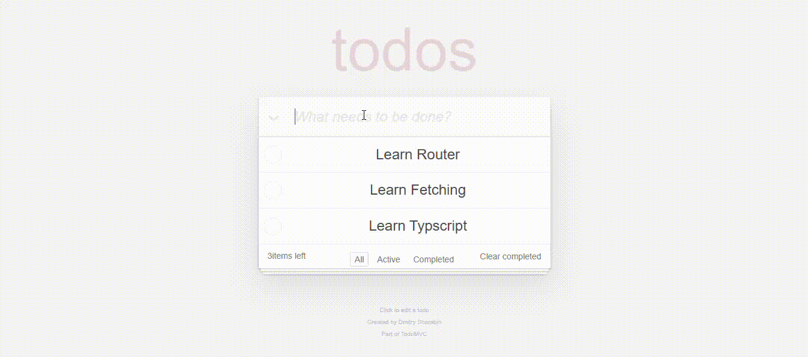

# React Todo App

This project is a **Todo App** built with **React**.  
The original task was provided in plain **HTML and CSS**, but I implemented it using React to practice state management, component-based structure, and modern frontend development patterns.

## Live Demo
[GITHUB PAGE LINK](https://neslihan1999ulug.github.io/React-Sport-Center-Project/)

## Project Preview


### Features
- Add new todos
- Mark todos as completed or active
- Filter todos by **All**, **Active**, and **Completed**
- Delete individual todos
- Clear all completed todos at once
- Persist data in **localStorage** (todos remain after page reload)

### Technologies Used
- **React** (functional components, hooks: `useState`, `useEffect`)
- **JavaScript (ES6+)**
- **CSS**

### Purpose
The main goal of this project was to:
- Rewrite an HTML & CSS based assignment into React
- Strengthen my understanding of React hooks and state management
- Practice building interactive UI with persistent data

### How to Run
```bash
# Install dependencies
npm install

# Start the development server
npm run dev